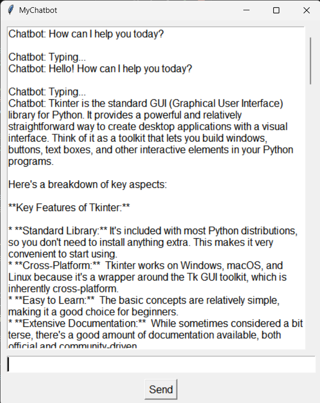

# 💬 Gemini Chatbot GUI (Python + Tkinter)

A simple desktop chatbot using Python's `tkinter` and Google's Gemini 2.0 Flash model via the Generative AI API. This app provides a clean chat interface where users can interact with a smart assistant directly from their desktop.

---

## 🧠 Features

- 🪟 GUI built with Tkinter  
- 🤖 AI replies powered by Gemini 2.0 Flash  
- ✨ Typing effect for realism  
- 🔁 Scrollable chat history  
- ✅ Works with any Gemini API key

---

## 🖼️ Preview

### 📷 App Screenshot




---

## 📝 How It Works
The app launches a window with a scrollable chat area.

You can type a message and hit Enter or click the Send button.

The chatbot replies using Gemini 2.0 Flash's response model.


---

## 🧼 Notes
Don’t forget to replace the API key with your own.

The chatbot uses the "models/gemini-2.0-flash" version if you are using free api.

Internet connection is required to fetch responses from the API.

## ⚙️ Requirements

🔐 API Key Setup
Visit Google AI Studio

Generate an API Key

Replace this in your script: 
API_KEY = "your-api-key-here"

---

## 📄 License
This project is open-source and free to use for learning or experimenting. No warranties provided. Please respect Google AI's API usage policies.

---

## Install the required Python package:

```bash
pip install google-generativeai

